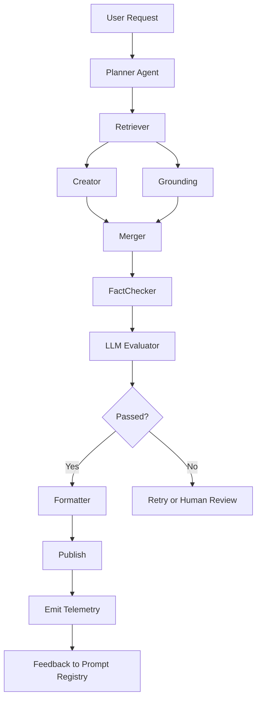
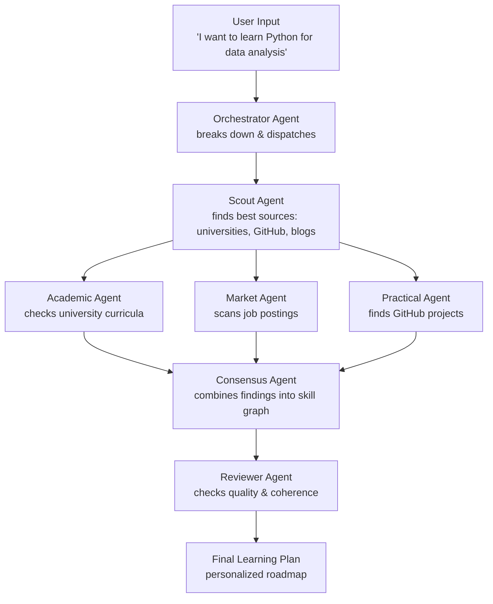
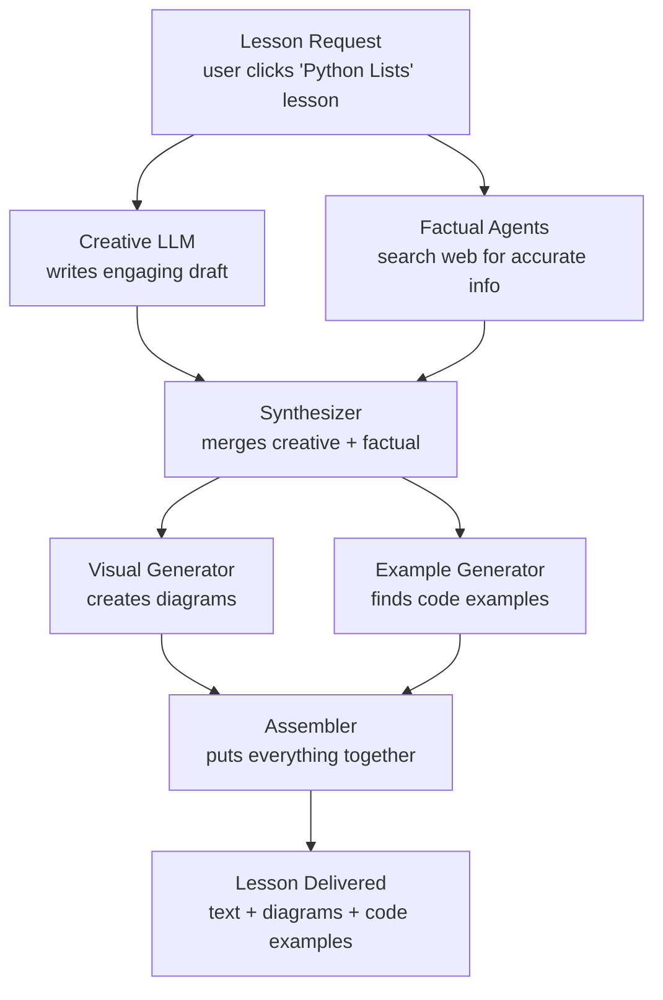
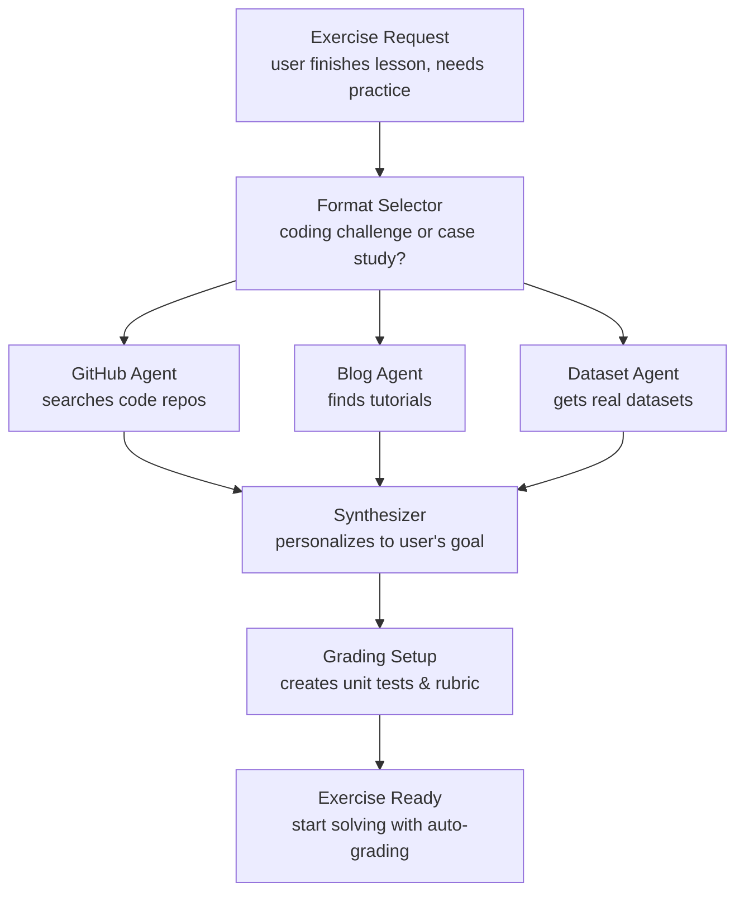

# MindMorph — Technical Architecture

> **Source:** transcribed from `MindMorph_detail.pdf`, `Brief Technical Architecture (1).pdf`,
> and `Detailed Technical Architecture (1).pdf`.
> **Naming note:** the source PDFs label the product **"SmartLearn"**. That is an older name;
> the canonical product name is **MindMorph**. All references below use **MindMorph**.
> This document is the **target/reference architecture** (the design intent). For what is
> actually built today, see [`IMPLEMENTATION_STATUS.md`](./IMPLEMENTATION_STATUS.md).

---

## 1. Product Vision

Today's learning landscape is fragmented: AI chatbots are text-heavy and lack guided hands-on
experience; Coursera/Udemy are expensive and one-size-fits-all; YouTube is unstructured passive
content; corporate training is static and outdated. **MindMorph** is an AI-powered personal learning
coach built to make learning effective, engaging, and directly tied to real-world outcomes.

### Four Core Principles

1. **Deep Personalization at Scale** — generates a unique learning path per user, adapting to their
   background, current skill level, and ultimate career/personal goals, even incorporating the
   user's own study materials.
2. **Practical, Application-First Learning** — focus on doing, not watching; every lesson builds
   job-ready skills through hands-on exercises, real-world examples, and interactive simulations.
3. **Total Flexibility for Any Schedule** — from quick 5-min "Boosts," 20-min "Builders," and
   2-hour "Sprints" to comprehensive structured courses, all guided by an ever-present AI Teaching
   Assistant.
4. **A Future-Proof Learning Ecosystem** — long-term: multi-language support, live 1:1 tutoring,
   and community features.

---

## 2. MVP Scope

Validate the core value proposition with foundational features on a single high-impact subject.

- **MVP target subject:** AI and Machine Learning fundamentals (beginners → experts).

### Core User Journeys (single intuitive prompt drives both)

- **Journey A — On-the-Spot Skill Boosts (immediate needs):** learn a specific topic quickly.
  Formats: **5-min Boosts**, **20-min Builders**, **2-hour Sprints**.
- **Journey B — Structured Learning Paths (long-term transformation):** comprehensive knowledge for
  a larger goal (career change, starting a business). The plan is personalized to the user's total
  available time and adapts daily, mixing micro-lessons with deeper dives.

### Key MVP Features

- **Seamless onboarding & deep personalization** — social sign-in (LinkedIn, Gmail), conversational
  goal assessment. For vague self-assessments, an optional **Dynamic Skill Assessment** (MCQs /
  interactive tasks) pinpoints the starting level. Users can **upload their own materials** (PDFs,
  notes, links), which are ingested and vectorized as a high-priority source.
- **Hyper-personalized learning plan** — a visual **Skill Dependency Graph** (the most efficient
  path to the goal). A living document that adapts to actual progress (condensing/expanding
  timelines).
- **Dynamic content engine** — multi-faceted lesson experience: **The Hook** (trending insight),
  **Explainers** (text + custom diagrams), **Real-World Examples** (live web-sourced case studies),
  hands-on simulations and step-by-step guides.
- **AI Teaching Assistant** — always-on, full awareness of the user's plan, progress, and history;
  can modify the plan, answer questions, give feedback, in chat **and voice** modes.
- **Automated grading & feedback** — instant feedback; coding challenges graded via **unit tests**,
  design/analytical tasks via a detailed **LLM rubric** (users can upload artifacts).
- **Screen Vision & Browser Automation agents** — for hands-on exercises requiring an external
  tool/website: the Screen Vision Agent sees the user's screen; the Browser Automation Agent
  highlights buttons and guides the user.

---

## 3. How It Works — The Generation Engine

### 3.1 Learning Graph Generation

Multi-step, agent-driven. Multiple LLMs generate a robust but generic baseline **Skill Graph**.
Specialist agents then enrich and validate it:

- **Academic Agent** — checks it against university curricula.
- **Market & Trends Agent** — adds the latest in-demand skills from job sites.
- **Practical Implementation Agent** — links skills to real-world projects (e.g., GitHub).

Output: a hyper-personalized roadmap.

### 3.2 Course Content Generation (dual-path)

- **Path A** — an LLM generates a creative, well-structured draft.
- **Path B** — AI agents perform live web searches for factually accurate, timely data (diagrams
  from university courses, case studies from blogs).
- A final **"Master" LLM** synthesizes the creative draft with the factual data → engaging,
  accurate, up-to-the-minute content.

### 3.3 Practical Component Generation

After a lesson, agents fetch the best raw materials from the live web (code from GitHub, case
studies from tech blogs). A final LLM synthesizes these into a unique exercise, rewriting/adapting
it to the user's specific role and goals.

---

## 4. Architecture Overview

MindMorph operates as a **network of modular, AI-augmented services** communicating via lightweight
APIs and event streams. Six layers: **user experience, orchestration, intelligence, data,
operations, analytics**.

### 4.1 Architecture Objective

Enable a scalable, adaptive, continuously improving AI learning platform that merges human teaching
with generative intelligence. Five core outcomes:

1. **Adaptive Learning Delivery** — content aligned to pace, skill, interests via AI personalization.
2. **Reliable & Observable Operations** — high availability, measurable latency, full request→response traceability.
3. **Model & Vendor Flexibility** — dynamically route to the most cost-effective / contextually suited LLM (GPT, Claude, Gemini, Bedrock).
4. **Continuous Improvement Loop** — real-time telemetry, analytics, and human feedback refine prompts, models, content.
5. **Global-Scale Security & Compliance** — data privacy, secure API access, region-aware deployment as first-class concerns.

### 4.2 Interaction Loop

Not a rigid hierarchy — an **interactive loop**:

```
Learner Interaction → Application Orchestration → AI/LLM Generation → Data Storage & Context Retrieval
                                  ↑                                                  │
                                  └──────────  Analytics & Feedback Systems  ◄───────┘
            (insights flow back to update prompts, models, and personalization policies)
```

### 4.3 Architectural Philosophy

| Principle | Description |
|---|---|
| **Modular & Observable** | Each component runs independently with unified monitoring/tracing — rapid iteration without losing visibility. |
| **AI-First Abstraction** | Business logic isolated from model logic via orchestration/routing layers — model/vendor swaps with minimal code impact. |
| **Continuous Learning Loop** | Data and analytics inform prompt, model, and content evolution. |

---

## 5. Core Components / Layers

### 5.1 Frontend Layer

- **Next.js (React)** for speed, scalability, SEO.
- **Auth0 / Clerk** for authentication.
- **WebSockets** for real-time chat and lesson rendering.
- **JupyterLite (WebAssembly)** for in-browser coding (no backend exec; sandboxed).
- **S3 + CDN (CloudFront/Cloudflare)** for global asset delivery.
- **TailwindCSS + Radix UI** for responsive, accessible UI.
- Telemetry: Frontend SDK → Kafka gateway (REST) for event streaming.
- Localization: **i18next** with locale JSONs.

### 5.2 Application Service Layer

- **FastAPI microservices** (async APIs) for speed and modularity.
- **LangGraph + CrewAI** orchestration drives multi-agent AI workflows.
- **Redis caching** + **Kafka messaging** for decoupled communication.
- **PostgreSQL ORM** for persistence.
- **Evaluation Service** — unit-test executor + LLM-based rubric + scoring engine for grading.
- **API Gateway + JWT** (Auth0) for central entry, security, rate limiting.
- **gRPC / REST** internal APIs; **Redis pub/sub** + **rate-limit middleware** for throttling.
- **Celery / Dramatiq** workers (Redis / RabbitMQ broker) for async/scheduled jobs (grading, embedding).
- Translates educational intent into AI-powered execution (the **core business logic**).

### 5.3 AI / LLM Layer

- **LangGraph + CrewAI** for orchestrating multi-agent workflows (defined agent types:
  Content Creator, Evaluator, Fact Checker, Context Retriever).
- **Model Router** — abstracts vendor APIs (GPT, Claude, Gemini, Bedrock), policy-based selection,
  cost-effective multi-model inference, fallback handling.
- **Prompt Registry** (Git + API interface) — prompt/version management, metadata, tags, performance
  metrics; reproducibility, rollback, A/B testing, automated evaluation.
- **RAG pipelines** — Pinecone vector search + web scraping (Playwright / Firecrawl) + context
  chunking/ranking to keep responses factual and current.
- **Evaluation** — DSPy / Phoenix / TruLens for automated quality scoring, accuracy/consistency
  tuning. **Multimodal**: Tesseract + image generation (DALL·E).
- Orchestrates multi-agent pipelines (creator → fact-checker → evaluator) that generate and refine
  lesson content.

### 5.4 Data Layer

- **Relational:** PostgreSQL (RDS) with JSONB for hybrid structured/unstructured data.
- **Caching:** Redis for hot data, rate limits, session state.
- **Object storage:** S3 for lesson assets, outputs, large files.
- **Vector DB:** Pinecone for semantic + personalization retrieval (FAISS as local fallback).
- **Event streaming:** Kafka (or AWS MSK / GCP PubSub) for high-throughput, replayable event logs.
- **Analytics storage:** BigQuery / Snowflake for warehouse queries & BI dashboards.
- **Backups & replication:** automated DB snapshots + S3 versioning; row-level security; IAM.

### 5.5 Infrastructure Layer

- **Kubernetes (EKS/GKE)** with full CI/CD automation via **GitHub Actions + Terraform** (IaC).
- **Prometheus + Grafana + OpenTelemetry** for metrics, dashboards, distributed tracing.
- **Logging:** ELK (Elasticsearch, Logstash, Kibana) / cloud logging.
- **Secrets:** Secrets Manager + IAM-controlled access.
- **Multi-region deployments + autoscaling** (HPA, cluster autoscaler) for global load.
- **Resilience:** multi-region clusters, CDN edge caching, cross-region backups; Argo Rollouts for
  blue-green / canary; mutual TLS / service mesh (Istio/Linkerd).

### 5.6 Analytics & Continuous Improvement Layer

- **Event streaming:** Kafka for real-time ingestion; **Spark Streaming** for live metrics.
- **Batch/ETL:** Airflow / Dagster for scheduled data workflows.
- **Warehouse:** BigQuery / Snowflake; visualized via Grafana / Metabase / Superset.
- **Experimentation:** LaunchDarkly / Flagsmith for A/B testing.
- **Human review:** Reviewer portal (Next.js + FastAPI) + Label Studio / Prodigy for annotation.
- Closes the loop: analytics → reviewer insights → prompt/model updates → deployment via LLM Ops.

### 5.7 LLM Ops & Production Architecture

Governs operational management, optimization, reliability of all LLM integrations: standardizes how
prompts/models/versions/costs are tracked, tested, deployed.

- **Model Router** — dynamically selects best-performing model per task (reduces cost & latency).
- **Evaluation pipelines** — version control + continuous improvement.
- **Observability** — Prometheus, OpenTelemetry, Grafana for full token-usage/cost/latency visibility.
- **CI/CD + secret management** — safe, repeatable, auditable deployment.

### 5.8 Security & Governance Layer

- **Identity & Access:** Auth0 / Clerk (OAuth2, OpenID), JWT-based API access.
- **RBAC enforcement:** policy-based rules at API Gateway + Postgres RLS.
- **Encryption:** TLS 1.3 in transit; KMS-managed AES-256 at rest.
- **Secret management:** AWS Secrets Manager for keys and tokens.
- **Logging & audit:** ELK stack or Cloud Logging for immutable audit trails.
- **Compliance:** GDPR / FERPA alignment; data retention policies.
- **PII handling:** PII scrubbing in pipelines + LLM calls (regex + ML detectors); SIEM (CloudTrail)
  anomaly alerts; opt-out tagging for sensitive data.

---

## 6. Agentic Flows (DAGs)

### 6.1 Generic Request DAG



### 6.2 Learning Plan Generation



### 6.3 Content Generation



### 6.4 Exercise Generation



---

## 7. Toolkit / Tech Stack Summary

| Concern | Target Technology |
|---|---|
| Agent framework | **LangGraph + CrewAI** (DAG/state control + role-based crews) |
| File processing | PyMuPDF (PDF text extraction) |
| Speech-to-Text | OpenAI Whisper (or similar) |
| Text-to-Speech | ElevenLabs (or similar) |
| LLM access / routing | Multi-vendor (GPT, Claude, Gemini, Bedrock) via Model Router |
| Grounding | Agentic web search, crawlers (Playwright / Firecrawl), deep research |
| API & task mgmt | FastAPI, Redis, Celery |
| Long-term memory | Vector DB (Pinecone) — evolving profile, history, content archive |
| Short-term memory | Redis — per-session context |
| Performance | Pre-computation + Redis caching of common plans/components |
| Frontend | Next.js 14, React 18, JupyterLite sandboxes |
| Prompt mgmt | Prompt Registry (LangSmith / Git) |
| Data | PostgreSQL (JSONB), S3, Kafka, BigQuery/Snowflake |
| Infra | Kubernetes, Terraform, Prometheus/Grafana/OpenTelemetry |

---

*MindMorph's architecture is a living system: every learner session strengthens its intelligence,
every prompt evolves through data, every deployment improves reliability —
AI-powered, data-driven, globally scalable, and human-centered.*
